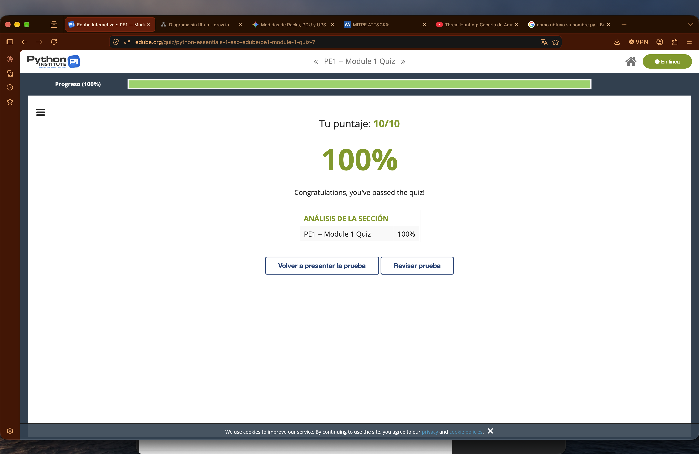
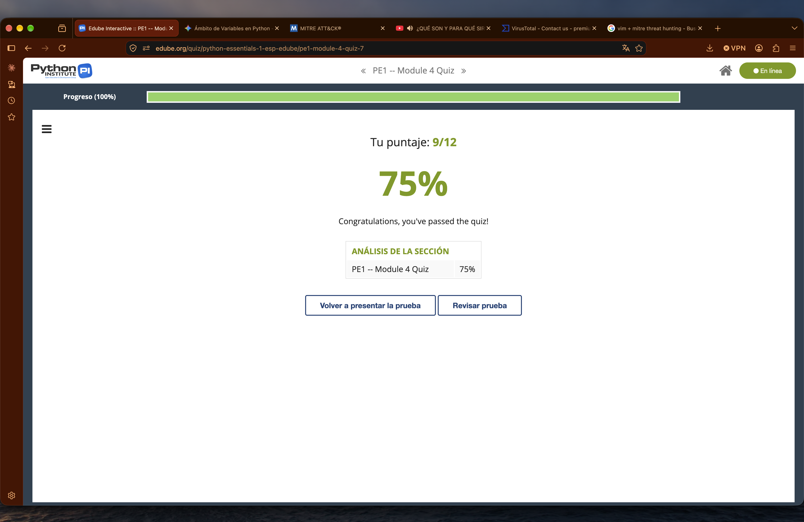

# Python_Essentials_1_SebastianVillegasArredondo

# Python Essentials 1 - Sebastián Villegas Arredondo

Apuntes del curso, con las capturas del quiz y del examen de cada módulo.

## Módulo 1

### Apuntes

### Quiz

### Examen

---

## Módulo 2

### Apuntes

### Quiz

### Examen

---

## Módulo 3

### Apuntes

### Quiz

### Examen

---

## Módulo 4

### Apuntes

### Quiz

### Examen
